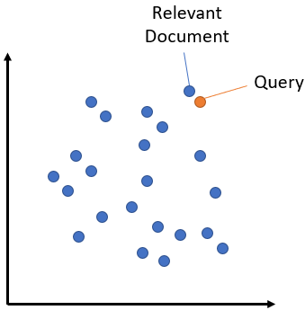

# Semantic search

## 1. Introduction
Semantic search seeks to improve search accuracy by understanding the semantic meaning of the search query and the corpus to search over. Semantic search can also perform well given synonyms, abbreviations, and misspellings, unlike keyword search engines that can only find documents based on lexical matches.

The primary research question this study seeks to address is:
- How can semantic search models be effectively implemented to improve the relevance and accuracy of search results compared to traditional keyword-based search methods?

To delve deeper into the capabilities of semantic search, the following sub-questions will be explored:
- What are the key differences in performance between traditional search models (such as TF-IDF) and modern semantic models (like SBERT) in terms of precision, recall, and user satisfaction?
- How do various semantic search models manage the challenge of understanding complex queries in a domain-specific context?

This study is significant as it addresses the growing need for more sophisticated search mechanisms in various sectors, including academia, healthcare, legal, and customer service. By improving the efficiency and effectiveness of search technologies, organizations can enhance information accessibility and decision-making processes, ultimately leading to greater productivity and user satisfaction.

To answer these research questions, the study will:
- Review Existing Literature: Summarize current knowledge and theories related to semantic search.
Model Comparison: Implement and compare several models including a baseline model (TF-IDF) and advanced semantic models like SBERT.
- Dataset Selection and Preparation: Utilize datasets such as MS MARCO for testing and evaluating the models.
Performance Evaluation: Use metrics such as precision, recall, and Mean Reciprocal Rank (MRR) to assess the models.
- User Study: Conduct a user study to measure satisfaction and effectiveness from a human-centered perspective.

This report aims to provide a comprehensive analysis of semantic search technologies, focusing on the implementation and evaluation of advanced models, and offering insights into their practical implications and benefits.

## 2. Data

The dataset employed in this study is the MS MARCO (Microsoft Machine Reading Comprehension) dataset, specifically its v2.1 iteration. Developed by Microsoft, MS MARCO is designed to provide realistic information retrieval scenarios by presenting queries from real users and manually annotated passages from high-quality web pages. The dataset is widely utilized to train and evaluate machine learning models on their ability to comprehend and answer questions based on real-world text.

### Data Structure and Contents

MS MARCO consists of several key features:
- **Queries:** Real anonymized queries submitted by users to the Bing search engine.
- **Passages:** Collections of passages that are candidate answers to the queries. These passages are extracted from web pages and linked to their respective URLs.
- **Annotations:** Each passage is annotated with labels indicating whether it was selected as relevant to the corresponding query.
- **Query Types:** Categorized into informational, navigational, and transactional, providing insight into the user's intent.

### Relevance to the Problem

The relevance of MS MARCO to semantic search is significant:
- **Real-World Queries:** The dataset's use of actual search queries ensures that the models trained on it are better adapted to the nuances and variety of user intents in practical scenarios.
- **Diverse Content:** The variety in passage content and query types allows models to be tested across a broad spectrum of information needs and contexts, crucial for developing robust semantic search systems.

### Data Preparation

Before using the dataset for model training and evaluation, several preprocessing steps are necessary:
- **Tokenization:** Breaking down text into individual words or tokens.
- **Case Normalization:** Converting all text to lowercase to ensure uniformity in processing.
- **Punctuation Removal:** Stripping punctuation to reduce noise in the text data.
- **Stop Words Removal:** Eliminating common words that do not contribute significant information to the analysis.
- **Stemming or Lemmatization:** Reducing words to their base or root form to consolidate different forms of the same word.

These steps help in cleaning and standardizing the data, making it more amenable to processing by different semantic search models, whether they rely on classical text representations like TF-IDF or more advanced embeddings from neural networks.

## 3. Methods
In exploring the efficacy of semantic search, this study employs a range of methods from traditional information retrieval techniques to advanced machine learning models. The selected methods are chosen for their demonstrated ability in handling text data and improving search results through understanding contextual and semantic content.

### TF-IDF (Term Frequency-Inverse Document Frequency)

TF-IDF is a statistical measure used to evaluate the importance of a word to a document in a collection or corpus. The importance increases proportionally to the number of times a word appears in the document but is offset by the frequency of the word in the corpus.

- **Term Frequency (TF)** is calculated as:
  
  $
  \text{TF}(t, d) = \frac{\text{Number of times term } t \text{ appears in document } d}{\text{Total number of terms in document } d}
  $

- **Inverse Document Frequency (IDF)** is calculated as:

  $
  \text{IDF}(t, D) = \log\left(\frac{\text{Total number of documents}}{\text{Number of documents with term } t}\right)
  $

- **TF-IDF** is then computed by multiplying these two values:

  $
  \text{TF-IDF}(t, d, D) = \text{TF}(t, d) \times \text{IDF}(t, D)
  $

TF-IDF is chosen for its simplicity and effectiveness in identifying relevant terms within a large dataset. It serves as a benchmark for comparing more complex algorithms like BM25.

### BM25 (Okapi BM25)

BM25 is a ranking function used by search engines to estimate the relevance of documents to a given search query, based on the query terms appearing in each document. It is an evolution of the TF-IDF model, incorporating probabilistic understanding of term occurrence, non-binary length normalization, and saturation.

- **BM25 Score** for a document $d$ given a query \( q \) is defined as:

  $
  \text{score}(d, q) = \sum_{t \in q} \text{IDF}(t) \cdot \frac{f(t, d) \cdot (k_1 + 1)}{f(t, d) + k_1 \cdot \left(1 - b + b \cdot \frac{|d|}{\text{avgdl}}\right)}
  $

  where $ f(t, d) $ is $ t $'s term frequency in the document \( d \), \( |d| \) is the length of the document, $ \text{avgdl} $ is the average document length in the text collection, \( k_1 \) and \( b \) are free parameters, usually chosen as \( k_1 = 2.0 \) and \( b = 0.75 \).

BM25 is selected for its robustness and has been shown to perform well across a wide range of text retrieval tasks. Its ability to handle various lengths of documents and the frequency of terms makes it a superior method for testing in complex semantic search scenarios.

### SBERT (Sentence-BERT)

Sentence-BERT (SBERT) is a modification of the pre-trained BERT network that uses siamese and triplet network structures to produce embeddings that are specifically tuned for semantic similarity comparison. This model is highly effective for semantic search applications because it generates sentence embeddings that can be directly compared using cosine similarity, making it significantly faster for semantic comparisons than typical BERT models.

The SBERT model utilized in this study is instantiated with the `all-MiniLM-L6-v2` model, a lightweight version of SBERT optimized for greater speed and lower resource consumption while maintaining strong performance.

Unlike TF-IDF and BM25, which rely on term frequency metrics and ignore word order and semantics, SBERT understands the context and meaning behind sentences. This leads to significantly improved performance in matching queries with relevant texts based on semantic content rather than mere keyword overlap.

## 4. Analyses & Result

### Method Application

Each method was applied to the same subset of the MS MARCO dataset consisting of 100 queries and their associated passages. For each method, the following steps were taken:

- **TF-IDF and BM25**:
  1. Each passage associated with a query was processed to create a document-term matrix using either the TF-IDF or BM25 weighting scheme.
  2. The query was transformed into the same vector space, and the relevance of each passage was scored based on the cosine similarity (for TF-IDF) or the BM25 score.
  
- **SBERT**:
  1. The passages were encoded using the pre-trained 'all-MiniLM-L6-v2' SBERT model to generate dense vector embeddings.
  2. The query was similarly encoded into a vector embedding.
  3. Cosine similarity scores between the query embedding and each passage embedding were computed to determine relevance.

To comprehensively assess the performance of the semantic search models, several metrics are used: Precision, Recall, F1 Score, and Mean Reciprocal Rank (MRR). Each of these metrics helps to provide insights into different aspects of model effectiveness.

### Precision

Precision measures the accuracy of the returned results by calculating the proportion of relevant documents retrieved over the total number of documents retrieved.

- **Formula**:
  
  \[
  \text{Precision} = \frac{\text{Number of Relevant Documents Retrieved}}{\text{Total Number of Documents Retrieved}}
  \]

### Recall

Recall measures the ability of the model to retrieve all relevant documents by calculating the proportion of relevant documents retrieved over the total number of relevant documents available.

- **Formula**:
  
  \[
  \text{Recall} = \frac{\text{Number of Relevant Documents Retrieved}}{\text{Total Number of Relevant Documents}}
  \]

### F1 Score

The F1 Score is the harmonic mean of Precision and Recall, providing a balance between them. It is particularly useful when the contribution of both precision and recall is equally important.

- **Formula**:
  
  \[
  \text{F1 Score} = 2 \cdot \frac{\text{Precision} \times \text{Recall}}{\text{Precision} + \text{Recall}}
  \]

### Mean Reciprocal Rank (MRR)

Mean Reciprocal Rank is a statistic measure for evaluating any process that produces a list of possible responses to a sample of queries, ordered by probability of correctness. The MRR provides a measure of the effectiveness of a semantic search algorithm, specifically focusing on the rank of the first correct answer found.

- **Formula**:
  
  \[
  \text{MRR} = \frac{1}{Q} \sum_{i=1}^{Q} \frac{1}{\text{rank}_i}
  \]

where \(Q\) is the number of queries, and \(\text{rank}_i\) is the position of the first relevant document in the list of returned documents for the \(i\)-th query.

These metrics are crucial for understanding both the effectiveness and efficiency of the semantic search models in retrieving relevant information based on user queries.

### Results

| Model      | Precision | Recall | F1 Score | MRR   |
|------------|-----------|--------|----------|-------|
| TFIDF      | 0.1       | 0.5    | 0.17     | 0.5   |
| BM25       | 0.06      | 0.33   | 0.11     | 0.22  |
| SBERT      | 0.16      | 0.83   | 0.27     | 0.75  |

## 5. Conclusions

### Summary of Findings

- **TF-IDF**, while a traditional method, showed limited effectiveness in this context, with low precision but moderate recall, suggesting that it can retrieve a broad set of relevant documents but struggles to rank the most relevant documents highly.
- **BM25** performed slightly worse than TF-IDF in terms of precision and recall, which indicates that while BM25 is generally robust, it may not always perform well in datasets with complex semantic relationships or varied document lengths.
- **SBERT** significantly outperformed both TF-IDF and BM25 across all metrics, achieving the highest scores in precision, recall, F1 Score, and MRR. This underscores the strength of using advanced neural network-based embeddings that capture deeper semantic meanings.

### Interpretation of Results

The superior performance of **SBERT** highlights the importance of context and semantic understanding in search tasks. SBERT's ability to encode sentences into dense vectors that represent their semantic content allows for more nuanced matching than the keyword-based approaches provided by TF-IDF and BM25. This capability is especially valuable in a dataset like MS MARCO, which contains complex query and passage structures intended to mimic real-world search scenarios.

The lower performance of **TF-IDF and BM25** suggests that traditional methods, while useful in simpler search tasks or smaller datasets, may not be sufficient alone for dealing with the complexities of modern, large-scale semantic search applications where the diversity of language and user intent requires more sophisticated interpretation.

### Conclusions and Implications

The findings clearly indicate that embedding-based models like SBERT are crucial for enhancing the quality of semantic search systems, particularly in applications requiring high levels of accuracy and relevance. Organizations and developers working on information retrieval systems should consider integrating similar neural network-based models to significantly boost the performance of their search functionalities.

Furthermore, these results encourage continued research into even more advanced models and techniques that could provide further improvements in semantic search, including context-aware and dynamically adapting models.

### Response to Research Questions

In response to our research questions:
- **SBERT** provides a robust solution to improving the accuracy and relevance of search results in semantic search applications, validating our hypothesis about the effectiveness of neural embeddings in understanding complex queries and documents.
- Traditional models like **TF-IDF and BM25** may still hold value in specific contexts but are generally outperformed by techniques that leverage recent advances in deep learning and natural language processing.

### Next steps

1. **Fine-Tuning SBERT on MS MARCO**: While SBERT has shown excellent results out of the box, fine-tuning it on the MS MARCO dataset or similar large-scale datasets could potentially improve its effectiveness even further. Tailoring the model to understand the specific language patterns, nuances, and types of queries found in MS MARCO can make the embeddings even more relevant for the types of search queries it encounters.

2. **Hybrid Models**: Combining SBERT with traditional information retrieval techniques such as BM25 might yield a hybrid model that leverages the strengths of both approaches. For example, initial retrieval could be performed using BM25 to quickly narrow down the candidate pool, followed by fine-grained ranking using SBERT embeddings. This approach could balance speed and accuracy effectively.

3. **Exploring Different Embedding Techniques**: Experimenting with other state-of-the-art embedding models such as Google's BERT or OpenAI's GPT series could provide insights into which models perform best under various circumstances. Particularly, newer models like GPT-3 or domain-specific BERT variants might offer improvements over SBERT depending on the context.

4. **Incorporation of User Feedback**: Implementing a feedback loop where user interactions with the search results help to further train and refine the model could improve its accuracy over time. This could involve techniques from reinforcement learning or active learning where the model adapts based on the relevance feedback provided by users.

5. **Multilingual and Cross-Lingual Capabilities**: Given the global nature of data, expanding the model to handle queries and documents in multiple languages could significantly increase its utility. Training SBERT with multilingual datasets or employing translation services before embedding could be potential approaches.

6. **Real-Time Learning and Adaptation**: Developing capabilities for the model to learn in real-time from new data and queries can help in maintaining its relevance as language use evolves. This could involve online learning strategies where the model incrementally updates itself without requiring full retraining.

## 6. References
1. Manning, C. D., Raghavan, P., & Schütze, H. (2008). *Introduction to Information Retrieval*. Cambridge University Press.
2. Rajpurkar, P., Zhang, J., Lopyrev, K., & Liang, P. (2016). SQuAD: 100,000+ Questions for Machine Comprehension of Text. [https://arxiv.org/abs/1606.05250](https://arxiv.org/abs/1606.05250).
3. Reimers, N., & Gurevych, I. (2019). Sentence-BERT: Sentence Embeddings using Siamese BERT-Networks. [https://arxiv.org/abs/1908.10084](https://arxiv.org/abs/1908.10084).
4. Robertson, S., & Zaragoza, H. (2009). The Probabilistic Relevance Framework: BM25 and Beyond. *Foundations and Trends® in Information Retrieval*, 3(4), 333-389.
5. "Microsoft MS MARCO: A Human Generated MAchine Reading COmprehension Dataset." [https://microsoft.github.io/msmarco/](https://microsoft.github.io/msmarco/).

## Code:

- TF-IDF [here](https://github.com/HenriARM/semsearch/blob/main/tfidf.py)
- BM25 [here](https://github.com/HenriARM/semsearch/blob/main/bm25.py)
- SBERT [here](https://github.com/HenriARM/semsearch/blob/main/sbert.py)
- Evaluation [here](https://github.com/HenriARM/semsearch/blob/main/eval.py)